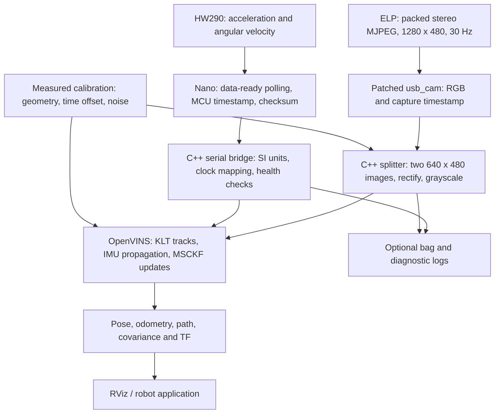

# OpenVINS stereo VIO: implementation and commissioning guide

Revision: 9 October 2026. Reference runtime: repository commit `21d83df`.
Handover with automated setup: `openvins-hw290-setup-20261009`.

## 1. Purpose and scope

This guide reproduces the working ROS 2 stereo visual inertial odometry (VIO)
pipeline using an ELP USB stereo camera, an HW290 IMU and an Arduino Nano.
It covers installation, acquisition, calibration, operation and acceptance.
The estimator reports the IMU's position and orientation in a local metric
frame. It does not provide GPS coordinates or a globally corrected trajectory.

**A new device needs its own calibration.** The supplied October 2 tower
profile is evidence and a file-format reference. Reuse it for live operation
only on that physically unchanged camera/IMU assembly, with the same camera
mode and acquisition settings. A similar printed mount is insufficient.

The reference passed a confirmed two-minute desk movement test without large
trajectory flights. This establishes bounded operation for that test, not
accuracy against independent ground truth or indefinite drift-free operation.
IMU noise and intrinsic correction matrices remain provisional.

### Implementation order

1. [Assemble and electrically verify the sensors.](#3-hardware-and-electrical-assembly)
2. [Install and build the software and patched camera driver.](#4-install-and-build-on-a-clean-host)
3. [Flash the firmware](#5-flash-and-verify-imu-firmware) and [check delivery.](#6-check-acquisition-before-calibration)
4. [Record and fit the new assembly](#7-calibrate-a-new-device), observing [the conventions.](#8-calibration-conventions-and-reference-settings)
5. [Validate a candidate](#9-validate-and-activate-the-new-profile), then [run normally.](#10-normal-operation)
6. [Save diagnostics](#11-diagnostics-and-computational-cost), retain [delivery fixes](#12-delivery-fixes-required-by-this-fork) and [troubleshoot.](#13-troubleshooting-and-handover-checklist)

All shell commands use Bash. Run them from the `open_vins` directory unless
a command explicitly changes directory. Replace paths labelled `REPLACE_...`.
Stop the running launcher before changing firmware, configuration or wiring.

## 2. System architecture



The IMU predicts orientation, velocity and position between images. Image
features constrain that prediction and the estimated sensor biases. Stereo
geometry supplies metric depth. The filter retains 11 pose clones and up to
50 persistent SLAM features; other tracks enter MSCKF updates. First Estimate
Jacobians (FEJ) preserve estimator consistency. There is no loop closure or
global map optimization in this launch.

Small orientation errors misproject gravity into horizontal acceleration.
Integrating that error twice can produce large position errors. Missing IMU
samples, blocked camera delivery, wrong transforms or timestamps, and poor
visual observations can therefore cause rapid divergence.

The data path is C++. Bash launches processes, and Python handles resource
accounting and calibration-derived TF arguments. These helper dependencies
are required even when the C++ IMU backend is selected.

### ROS interfaces

| Topic | Type / content | Reference rate and frame |
|---|---|---|
| `/image_raw` | `sensor_msgs/Image`, packed `rgb8` | 30 Hz, `camera_link` |
| `/cam0/image_raw`, `/cam1/image_raw` | `sensor_msgs/Image`, `mono8`, 640 x 480 | 30 Hz, `cam0` / `cam1` |
| `/cam0/camera_info`, `/cam1/camera_info` | `sensor_msgs/CameraInfo` | Matching image headers |
| `/imu0` | `sensor_msgs/Imu` | About 100 Hz, `imu` |
| `/ov_msckf/poseimu` | `geometry_msgs/PoseWithCovarianceStamped` | Estimated IMU pose in `global` |
| `/ov_msckf/odomimu` | `nav_msgs/Odometry` | IMU odometry in `global` |
| `/ov_msckf/pathimu` | `nav_msgs/Path` | Estimated path in `global` |
| `/tf`, `/tf_static` | TF | `global -> imu -> cam0, cam1` |

**The split topics retain the name `image_raw` in both modes:** normal VIO
publishes rectified images; `--raw-stereo` publishes unrectified images for
calibration. Record the mode with every bag. Do not fit raw lens distortion
to already rectified images.

`/imu0` uses rad/s and m/s², with gravity included in acceleration. It does
not contain a measured attitude; `orientation_covariance[0]` is `-1`.
Camera optical axes are x right, y down, z forward. IMU samples retain the
sensor's native axes; the calibrated transform relates those axes to cameras.
The local `global` frame has no surveyed origin or absolute yaw reference.
To report a robot base pose, compose the estimated IMU pose with a separately
measured rigid IMU-to-base transform.

## 3. Hardware and electrical assembly

### Reference equipment

| Component | Tested configuration |
|---|---|
| Host | Ubuntu 22.04.5 LTS, x86_64, four CPU cores, approximately 16 GB RAM |
| ROS | ROS 2 Humble |
| Camera | ELP side-by-side USB stereo, USB ID `32e4:2b10` |
| Image mode | MJPEG 1280 x 480 at 30 Hz; left half is cam0 |
| IMU | HW290 breakout reporting `WHO_AM_I=0x98`, consistent with ICM-20689 |
| MCU | Classic Nano, ATmega328P, CH340 USB ID `1a86:7523` |
| Firmware target | `arduino:avr:nano:cpu=atmega328old`, AVR core 1.8.8 |
| Acquisition | 100 Hz, ±8 g, ±1000 degrees/s, I2C 100 kHz, serial 115200 baud |
| Mount | Camera and IMU fixed together in the October 2 printed tower |

HW290 is a module label, not sufficient identification of its chip or power
circuit. The firmware accepts identities `0x98` and `0x68` only. Another IMU
needs a verified driver, register configuration, scales and calibration.

### Wiring

| Nano connection | Module connection | Requirement |
|---|---|---|
| A4 / SDA | SDA | Correct bus voltage and pull-up network |
| A5 / SCL | SCL | Correct bus voltage and pull-up network |
| GND | GND | Common ground |
| Verified supply | VCC input specified for the breakout | Verify the actual board schematic |
| Host USB | Nano USB | Data-capable cable with strain relief |

The assembled reference powered its breakout VCC input from Nano 5 V. This
does **not** establish that another HW290 board accepts 5 V or that its SDA/SCL
pins tolerate 5 V. TDK specifies ICM-20689 VDDIO up to 3.45 V. A breakout's
regulator does not by itself establish I2C level conversion. Verify chip-side
voltages and the breakout circuit; use a suitable bidirectional I2C level
shifter when interfacing a 5 V Nano to a 3.3 V-only sensor. See the
[TDK electrical specification](https://product.tdk.com/en/search/sensor/mortion-inertial/imu/info?part_no=ICM-20689)
and [classic Nano pinout](https://docs.arduino.cc/hardware/nano/).

I2C needs pull-ups. Determine what the breakout, MCU and any level shifter
already provide before adding resistors. Check bus rise time and logic levels
with an oscilloscope if communication is unreliable; an idle voltmeter reading
or continuity test cannot establish signal integrity during motion.

Keep the leads short and secure. The reference shortened approximately 50 cm
loose jumpers to approximately 17 cm, soldered the Nano end and secured the
module end. Secure USB plugs and provide slack so moving the tower does not
pull on them. A source data failure invalidates the VIO test.

The CAD source is [vio_rig_stand_simple.scad](vio_rig_stand_simple.scad).
Its rig axes are X right, Y forward, Z up, origin at the base center. The
nominal lens centers are `(−30, 15, 206)` and `(30, 15, 206)` mm; the IMU
board center is `(0, −16.7, 206)` mm. Extract its calibration priors with
OpenSCAD rather than reconstructing transform signs from photographs:

```bash
QT_QPA_PLATFORM=offscreen openscad -o /tmp/vio_tower_geometry.csg \
  hw290_stereo/vio_rig_stand_simple.scad
```

CAD geometry is a check on the fit, not a calibrated camera/IMU rotation or
time offset. The IMU die center also differs from the breakout board center.

## 4. Install and build on a clean host

### Automated setup

On Ubuntu 22.04, install Git if needed, then obtain the version including the
setup scripts:

```bash
sudo apt update
sudo apt install git
git clone https://github.com/A-C-Simon/VisualInertialOdometry_ros2_gazebo.git \
  "$HOME/VisualInertialOdometry_ros2_gazebo"
cd "$HOME/VisualInertialOdometry_ros2_gazebo/open_vins"
git checkout openvins-hw290-setup-20261009
./hw290_stereo/setup_hw290_openvins.sh --with-calibration-tools
source hw290_stereo/env_hw290.sh
```

Run the installer as your normal account; it requests sudo for system packages.
It configures the ROS repository when needed, installs dependencies, adds
serial/video groups, builds the four hardware packages and patched camera,
and prepares Arduino CLI, AVR core 1.8.8 and an isolated bag conversion venv.
The calibration option also installs Docker if absent and builds pinned
Kalibr/Allan images. Existing Docker installations are reused. Docker build
commands can use sudo without adding the account to the Docker group.

Omit `--with-calibration-tools` if fitting on another host. Use `--jobs 2`
to control compilation, `--skip-system` to reuse system packages, or
`--skip-build` to defer compilation. Repeating setup reuses installed tools
and build caches. Logs and installed versions are saved under
`benchmark/results/setup_*`.

```bash
./hw290_stereo/setup_hw290_openvins.sh --dry-run --with-calibration-tools
./hw290_stereo/setup_hw290_openvins.sh --check
```

Preview performs no writes or downloads. Check reports missing software and
returns nonzero if incomplete; it does not initialize hardware or validate
the camera/IMU mount. A check including calibration images also needs Docker
query access. Setup leaves firmware, calibration and shell startup files
unchanged. Log out and in if groups were newly added, then source
`env_hw290.sh` in each operating shell. It preserves an existing ROS domain
or defaults to 48; the conversion venv stays off Python's search path.

After successful setup, continue at Section 5. The steps below provide the
manual installation alternative. The automated flow is covered by simulated
installation tests; a complete clean-host installation and fresh calibration
image build have not been completed on 9 October.

### 4.1 Operating system and dependencies

Use native Ubuntu 22.04 for this reference. Install ROS 2 Humble Desktop and
configure its apt repository using the
[official Humble installation procedure](https://docs.ros.org/en/humble/Installation/Ubuntu-Install-Debs.html).
That procedure includes locale, repository signing and the OS update required
before ROS installation. Do not mix ROS distributions or source an unrelated
workspace in the build shell.

After the ROS apt repository is configured:

```bash
sudo apt update
sudo apt install ros-humble-desktop ros-dev-tools \
  python3-colcon-common-extensions python3-rosdep \
  build-essential cmake git pkg-config v4l-utils ffmpeg usbutils openscad \
  libavcodec-dev libavutil-dev libswscale-dev \
  libeigen3-dev libboost-all-dev libceres-dev \
  libopencv-dev libopencv-contrib-dev libyaml-cpp-dev libssl-dev qtbase5-dev \
  python3-dev python3-numpy python3-scipy python3-yaml python3-serial \
  python3-pip python3-venv \
  ros-humble-cv-bridge ros-humble-image-transport ros-humble-image-transport-plugins \
  ros-humble-camera-info-manager ros-humble-ament-cmake-auto \
  ros-humble-rosidl-default-generators ros-humble-message-filters \
  ros-humble-tf2-ros ros-humble-tf2-geometry-msgs ros-humble-rosbag2
```

Use the distribution OpenCV libraries, including those used by `cv_bridge`.
Mixing incompatible OpenCV builds can crash the process. Gazebo, ORB-SLAM3,
Pangolin and CUDA are not needed for this hardware pipeline.

### 4.2 Obtain this fork and build the four hardware packages

```bash
git clone https://github.com/A-C-Simon/VisualInertialOdometry_ros2_gazebo.git \
  "$HOME/VisualInertialOdometry_ros2_gazebo"
export VIO_WS="$HOME/VisualInertialOdometry_ros2_gazebo/open_vins"
cd "$VIO_WS"
# The tag includes this guide and the documented runtime.
git checkout openvins-hw290-setup-20261009
source /opt/ros/humble/setup.bash
colcon --log-base log_vio build \
  --base-paths ov_core ov_init ov_msckf ov_hw290 \
  --build-base build_vio --install-base install_vio --symlink-install \
  --cmake-args -DCMAKE_BUILD_TYPE=Release
source install_vio/setup.bash
```

On a memory-constrained host, add `--executor sequential` and set
`CMAKE_BUILD_PARALLEL_LEVEL=2` for the build. Hardware performance on another
CPU architecture has not been established; rebuild and repeat commissioning.

Expected binaries:

```text
install_vio/ov_msckf/lib/ov_msckf/run_subscribe_msckf
install_vio/ov_hw290/lib/ov_hw290/hw290_imu
install_vio/ov_hw290/lib/ov_hw290/stereo_splitter
install_vio/ov_hw290/lib/ov_hw290/calibration_screen
install_vio/ov_hw290/lib/ov_hw290/build_rectified_profile
install_vio/ov_hw290/lib/ov_hw290/check_mount_calibration
```

### 4.3 Build the camera timestamp correction

```bash
./hw290_stereo/build_camera_driver.sh
```

This fetches `ros-drivers/usb_cam` version `0.8.1`, applies the tracked
[timestamp patch](patches/usb_cam-0.8.1-timestamps.patch), and installs it under
`install_camera/usb_cam`. The launcher directly uses that executable and
library directory. Installing the stock apt driver alone does not reproduce
this pipeline. Its [build definition](https://github.com/ros-drivers/usb_cam/blob/0.8.1/CMakeLists.txt)
requires the FFmpeg development libraries included above.

The patch corrects a microsecond conversion in the monotonic-to-epoch offset.
The splitter's `auto_timestamp_correction` is explicitly disabled by the
launcher. Do not apply a second arrival-time correction to this driver's
capture timestamps.

### 4.4 Device access and paths

```bash
sudo usermod -aG dialout,video "$USER"
```

Log out and in after changing groups. Then identify the actual devices:

```bash
lsusb
ls -l /dev/serial/by-id/ /dev/v4l/by-id/
v4l2-ctl --list-devices
v4l2-ctl -d /dev/video0 --list-formats-ext
v4l2-ctl -d /dev/video0 --list-ctrls
```

The reference launcher assumes camera `/dev/video0` and Nano `/dev/ttyUSB0`.
There is no launcher `IMU_PORT` environment variable. If these paths differ:

- Set `video_device` in [usb_cam_hw290.yaml](usb_cam_hw290.yaml).
- Set the same camera path in `configure_hw290_camera()` in
  [process_helpers.sh](process_helpers.sh) and update the launcher's device check.
- In `start_hw290_imu()` in that helper, pass `--ros-args -p port:=YOUR_PATH`
  to the C++ bridge, preserving `raw_log_path` when diagnostics are enabled.
  Update the launcher's serial device check too.

Prefer verified persistent device symlinks. Some CH340 clones have no unique
serial number; identify them by physical USB port if necessary. Close serial
monitors and other camera applications before launching. The bridge takes an
exclusive serial-port lock.

## 5. Flash and verify IMU firmware

Install [Arduino CLI](https://docs.arduino.cc/arduino-cli/installation/) using
its official installation instructions. The authoritative sketch is
[firmware/hw290_openvins/hw290_openvins.ino](firmware/hw290_openvins/hw290_openvins.ino).
It uses `Wire`; no third-party sensor library is required.

```bash
arduino-cli core update-index
arduino-cli core install arduino:avr@1.8.8
arduino-cli compile --fqbn arduino:avr:nano:cpu=atmega328old \
  --build-path /tmp/hw290_vio_firmware \
  hw290_stereo/firmware/hw290_openvins
arduino-cli upload --fqbn arduino:avr:nano:cpu=atmega328old \
  --port /dev/ttyUSB0 --input-dir /tmp/hw290_vio_firmware
```

Select `cpu=atmega328` instead if the actual classic Nano uses the newer
bootloader. Other Nano-family processors need their own verified port.
The firmware uses I2C address `0x68`; an address-selection pin must select
that address. An identity of `0x98` is the WHO_AM_I value, not the bus address.

The sketch resets and verifies the sensor, disables FIFO/DMP operation,
sets ranges and digital filters, polls data readiness and timestamps each
sample before its I2C data read. This is polling, not hardware synchronization
to camera exposure. It verifies the configuration and acquisition rate during
operation and reports I2C faults.

Serial packets are:

```text
IMU3,sequence,micros,ax,ay,az,gx,gy,gz,temp*HH
```

`HH` is an XOR checksum over the preceding ASCII payload. Acceleration uses
4096 counts/g and gyro 32.8 counts/(degree/s). The bridge converts to SI,
checks sequence order, extends MCU time across normal wraparound, and maps
it to the host clock. The first 100 samples warm up the clock estimate.
Serial receipt time is adjusted for queued-byte transmission time; it is
not substituted for source acquisition time.

Opening the serial port resets this Nano. Restart the complete VIO launch
after a reset or disconnection. Do not reconnect a reset MCU into an estimator
that still contains the previous time history. Do not run the temporary
`HW290_IDLE_VOLTAGE` diagnostic firmware for VIO.

## 6. Check acquisition before calibration

### 6.1 Mark a new physical assembly as uncalibrated

On a **new assembly's checkout**, save the shipped mount metadata separately,
then replace `hw290_stereo/calibration/current_mount.yaml` with:

```yaml
%YAML:1.0
---
mount_id: "my_device_01"
status: "requires_calibration"
reason: "New assembly; camera/IMU geometry and time offset not validated."
```

This prevents normal VIO from accepting the reference tower's profile. Raw
sensor acquisition remains available. Do not change a working tower's
metadata merely to read this guide.

### 6.2 Run the sensors

```bash
export ROS_DOMAIN_ID=48
./hw290_stereo/run_hw290_openvins.sh \
  --sensors-only --no-rviz --diagnostics --raw-stereo
```

In a second terminal:

```bash
cd "$HOME/VisualInertialOdometry_ros2_gazebo/open_vins"
source /opt/ros/humble/setup.bash
source install_vio/setup.bash
export ROS_DOMAIN_ID=48
python3 hw290_stereo/inspect_sensors.py --seconds 30 --reliable-images \
  --output /tmp/hw290_stationary.json
```

Keep the rig still for this measurement. Require approximately 100 Hz IMU,
approximately 30 Hz images, increasing timestamps, no corrupt packets,
saturation, sequence gaps or firmware I2C faults. The average acceleration
magnitude should be near 9.81 m/s²; a stationary gyro should have a stable
small bias. Do not subtract gravity or force the stationary gyro to zero in
the transport driver. Inspect interval maxima as well as averages.

The bridge requires verified source and startup delivery rates of 80 to
120 Hz. Source gaps above 50 ms, sustained slow delivery, a stopped stream
or a serial failure terminate the bridge. The launcher stops estimation
when a critical process exits. A 100 Hz average does not exclude individual
faults or gaps.

The inspector observes its own subscription and cam0 only. It does not prove
that both stereo streams, the bag recorder and the estimator received every
sample. Check those separately. Stop with Ctrl-C to flush the bag and summary
before inspecting its SQLite data.

### 6.3 Exposure and time alignment

The launcher sets and reads back manual exposure `50` and gain `255`, after
camera startup. For this camera, exposure units are 100 microseconds, so this
means 5 ms. These settings preserved texture under the tested desk lighting.
See the [V4L2 exposure definition](https://docs.kernel.org/userspace-api/media/v4l/ext-ctrls-camera.html).

Check actual images for darkness, saturation and motion blur. Other cameras
have different control names/ranges, and gain 255 is not a universal setting.
Modify both the camera YAML and helper's setting/readback checks if needed.
Keep focus, resolution, frame rate and lens configuration fixed through
calibration and use.

Both camera and IMU timestamps are mapped to the same host clock. Left/right
headers match because both images come from one packed frame. This does not
independently verify simultaneous exposure of the two sensors. There is no
hardware camera/IMU trigger. Avoid host clock steps during a run; a different
driver or acquisition mode requires renewed timing checks and calibration.

## 7. Calibrate a new device

Build the offline tools using [CALIBRATION_TOOLS.md](CALIBRATION_TOOLS.md).
That document covers the previously implicit Docker image, ROS bag conversion
and Allan analysis. Perform the following steps in order.

### 7.1 Measure the target

Use a flat, rigid Aprilgrid with known dimensions. The supplied
[A4 PDF](calibration/aprilgrid_6x6_a4.pdf) has 6 x 6 tags, nominal 23 mm black
tag edges and spacing ratio 0.30. Print at actual size and measure the black
edge. A 40 mm screen tag with 12 mm gap also has spacing 0.30.

For a screen recording:

```bash
./hw290_stereo/run_hw290_openvins.sh --calibration-screen
```

Measure the tag edge **in the actual fullscreen layout** and enter that value
in millimetres in the window. The initial 40 mm field is a default, not a
measurement. Browser scaling or another monitor can change physical size.
Use each recording's saved `target.yaml` for fitting; the printed 23 mm YAML
must not be used for a 40 mm screen capture.

The fullscreen window has stereo previews at the top right. Red means wait;
green means recording has started and movement should begin. Readiness checks
fresh stereo images, sufficient matching tags, IMU rate and recorder
subscriptions, then counts down five seconds. It tolerates brief fluctuations.
No terminal response is needed during fullscreen operation. Capture ends
automatically after 90 seconds; Esc cancels. Incomplete captures are not valid
calibration data.

### 7.2 Measure IMU noise

With normal firmware and a motionless, thermally stable rig:

```bash
./hw290_stereo/run_hw290_openvins.sh --imu-allan
```

Record at least three hours and use Allan analysis as described in the tools
document. Check fitted curves before accepting the four noise coefficients.
The shipped successful profile used provisional values:

| Coefficient | Shipped value | Continuous-time units |
|---|---:|---|
| Accelerometer noise density | 0.02 | `(m/s²)/sqrt(Hz)` |
| Accelerometer bias random walk | 0.003 | `(m/s²)/sqrt(s)` |
| Gyro noise density | 0.005 | `(rad/s)/sqrt(Hz)` |
| Gyro bias random walk | 0.00002 | `(rad/s)/sqrt(s)` |

These values are not measurements of a new sensor. Do not replace continuous
noise density with per-sample standard deviation. IMU scale/misalignment
matrices are separate from these noise coefficients and remain identity in
the reference. See [OpenVINS calibration guidance](https://docs.openvins.com/gs-calibration.html).

### 7.3 Record raw stereo, then dynamic camera/IMU data

Use two captures with the target size and camera mode fixed:

- **Stereo capture, 90 to 120 seconds:** vary distance and orientation, cover
  the image center and edges in both cameras. A printed target can move while
  the rig is fixed. For a screen, keep it fixed and move the complete rig.
- **Dynamic capture, 30 to 60 seconds:** keep the target fixed and move the
  complete rig with smooth roll, pitch, yaw and translation. Keep the target
  visible in both lenses. Avoid shocks, constant single-axis motion and blur.

The fullscreen tool can handle each capture. For a 60-second dynamic capture:

```bash
CALIBRATION_SECONDS=60 ./hw290_stereo/run_hw290_openvins.sh --calibration-screen
```

Alternatively record a printed target with:

```bash
./hw290_stereo/run_hw290_openvins.sh \
  --sensors-only --no-rviz --diagnostics --raw-stereo
```

Stop that manual capture with Ctrl-C. Save a matching target YAML with each
run. Review recorded images, IMU timestamp intervals, recorder losses and raw
serial health before fitting. Adequate preview rate alone is insufficient.

### 7.4 Fit cameras, then camera/IMU geometry and timing

Follow the copyable commands in [CALIBRATION_TOOLS.md](CALIBRATION_TOOLS.md).
Fit stereo `pinhole-radtan` intrinsics/extrinsics from raw images, then fit
camera/IMU extrinsics and time offsets using that stereo chain, the measured
noise file and the dynamic recording. Inspect both PDF reports and residuals.

Useful checks are reprojection errors around 0.2 to 0.5 pixels, physically
plausible baseline and rotation, predicted IMU measurements matching the
recorded motion, and no source gaps. This pixel range is guidance, not an
automatic acceptance rule. Poor fits need better data or a corrected sensor
model, not a manually forced baseline.

### 7.5 Build a matching rectified profile

Create an OpenVINS IMU model by copying the nested
[reference imu.yaml](calibration/20261002_tower/candidate/imu.yaml) to your
calibration work directory. Replace its four noise coefficients with the
reviewed Allan results; verify topic `/imu0` and rate 100.0. Do not copy a flat
Kalibr IMU YAML directly in place of this nested `imu0` model.

With `CAL_WORK` set by the tools document:

```bash
export PROFILE="$VIO_WS/hw290_stereo/calibration/my_device_01"
# PROFILE must not already exist.
./install_vio/ov_hw290/lib/ov_hw290/build_rectified_profile \
  "$CAL_WORK/dynamic-camchain-imucam.yaml" \
  "$CAL_WORK/imu_openvins.yaml" \
  hw290_stereo/estimator_config.yaml "$PROFILE"
export HW290_VIO_CONFIG="$PROFILE/estimator_config.yaml"
export HW290_STEREO_CALIBRATION="$PROFILE/stereo_opencv.yaml"
```

The converter writes `camchain_raw.yaml`, `camchain.yaml`, `stereo_opencv.yaml`,
`imu.yaml` and a local `estimator_config.yaml`. Keep them together. It requires
two 640 x 480 pinhole/radtan cameras and checks rigid-transform consistency.
It does not assess calibration residuals or physically validate the mount.

## 8. Calibration conventions and reference settings

### 8.1 Transforms and time offset

For homogeneous column vectors, `T_A_B` maps coordinates in B into A:

```text
p_A = T_A_B * p_B
T_rectcam_imu = [R_rect, 0; 0, 1] * T_rawcam_imu
T_imu_rectcam = inverse(T_rectcam_imu)
t_imu = t_camera + timeshift_cam_imu
```

Kalibr's raw `T_cam_imu` maps IMU to raw camera coordinates. The live OpenVINS
`T_imu_cam` maps rectified camera to IMU coordinates. Rectification rotates
the frame before inversion. An IMU position expressed in camera axes cannot
be inserted directly into the translation column of `T_imu_cam`. The raw
transform and time-shift definitions follow [Kalibr's YAML specification](https://github.com/ethz-asl/kalibr/wiki/yaml-formats).

`stereo_opencv.yaml` supplies raw K/D and R1/R2/P1/P2 to the splitter.
The matching `camchain.yaml` supplies rectified intrinsics, zero distortion
and transformed extrinsics to OpenVINS. Zero distortion describes the
processed images, not the physical lenses. Do not rectify twice or combine
the matrices from different fits.

For stereo processing, this implementation uses cam0's fitted time offset.
The stored cam1 offset is not independently applied to its image header.
Do not also add the fitted shift in the camera driver or serial bridge.

### 8.2 Selected tower profile

Active configuration: [estimator_config.yaml](estimator_config.yaml).
Calibration bundle:
[calibration/20261002_tower/candidate/](calibration/20261002_tower/candidate/README.md).
Despite the directory name, this is the selected, validated tower profile.

| Quantity | Measured / configured value |
|---|---:|
| Stereo baseline | 57.33584 mm |
| Cam0 time shift | +14.58435 ms |
| Cam1 time shift | +14.99032 ms |
| Rectified fx = fy | 372.46673 pixels |
| Rectified cx, cy | 318.36011, 266.83204 pixels |
| Mean cam0 / cam1 reprojection error | 0.342 / 0.388 pixels |
| Raw cam0 IMU origin | [27.639, -9.326, -54.567] mm |

The fitted baseline differs from the nominal 60 mm CAD value. The fitted IMU
origin is 24.808 mm from the CAD board-center prior; this remains unexplained.
Do not describe that agreement as established. The old root file
`hw290_stereo/kalibr_imucam_chain.yaml` and October 1 profile belong to the
previous mount and must not replace this tower bundle.

### 8.3 Estimator settings to preserve initially

| Setting | Reference value / purpose |
|---|---|
| `use_stereo`, `max_cameras` | `true`, `2` |
| `use_fej`, `integration` | `true`, `rk4` |
| `calib_cam_extrinsics`, `calib_cam_intrinsics`, `calib_cam_timeoffset` | All `false`; use reviewed offline calibration |
| `calib_imu_intrinsics`, `calib_imu_g_sensitivity` | Both `false` |
| `init_dyn_use`, `init_window_time` | `false`, `2.0` seconds; stationary initialization |
| `try_zupt`, `zupt_only_at_beginning` | Both `true` |
| `max_clones`, `max_slam` | `11`, `50` |
| `max_msckf_in_update`, `max_slam_in_update` | `40`, `25` |
| `use_klt`, `num_pts` | `true`, `250` |
| `track_frequency` | `35.0`; input camera still runs at 30 Hz |
| `downsample_cameras` | `false` |
| `num_opencv_threads` | `4` |
| `up_msckf_chi2_multipler`, `up_slam_chi2_multipler` | `5`; retained relaxed gates, not a substitute for calibration |
| `multi_threading_pubs` | `false`; does not disable the camera update worker |

The spellings above match the actual YAML, including `multipler`. Preserve
the remaining settings in the template until the new device passes acceptance.
Change one setting at a time and compare the same recordings.

## 9. Validate and activate the new profile

After reviewing the fit, create candidate metadata with its actual hashes:

```bash
export PROFILE="$VIO_WS/hw290_stereo/calibration/my_device_01"
export HW290_VIO_CONFIG="$PROFILE/estimator_config.yaml"
export HW290_STEREO_CALIBRATION="$PROFILE/stereo_opencv.yaml"
python3 - <<'PY'
import hashlib, os
from pathlib import Path
p = Path(os.environ['PROFILE'])
h = lambda name: hashlib.sha256((p / name).read_bytes()).hexdigest()
metadata = Path(os.environ['VIO_WS']) / 'hw290_stereo/calibration/current_mount.yaml'
metadata.write_text('%YAML:1.0\n---\n'
    'mount_id: "my_device_01"\n'
    'status: "fitted_pending_validation"\n'
    f'validated_chain_sha256: "{h("camchain.yaml")}"\n'
    f'validated_stereo_sha256: "{h("stereo_opencv.yaml")}"\n'
    'reason: "Fit reviewed; fresh physical validation still required."\n')
PY
./install_vio/ov_hw290/lib/ov_hw290/check_mount_calibration \
  hw290_stereo/calibration/current_mount.yaml \
  "$HW290_VIO_CONFIG" "$HW290_STEREO_CALIBRATION" --candidate
./hw290_stereo/run_hw290_openvins.sh --calibration-test --diagnostics
```

Hold the rig stationary during startup, then perform the acceptance sequence
below. Review the saved run before changing metadata status to `validated`.
Keep the same fingerprints and record the accepted test identifier in `reason`.
Normal launch rejects `fitted_pending_validation`; explicit trial mode accepts
it. `requires_calibration` and mismatched hashes are rejected in either mode.

The check covers the selected camera/IMU chain and stereo file only. It cannot
detect physical mount movement and does not hash the entire estimator or IMU
noise configuration. Maintain a configuration archive and repeat testing
after any relevant physical or software change.

### Acceptance sequence

1. **Stationary:** initialize facing static texture, then remain still for
   30 seconds. Check pose stability, camera updates and IMU health.
2. **Measured translation:** move approximately 20 cm and return. Compare
   estimated displacement and return error with the physical measurement.
   Record the observed error; no centimetre-level guarantee is established.
3. **Continuous movement:** move for at least two minutes, including gentle
   rotations and translations, inside a measured workspace. The reference
   used a 1.40 x 0.80 m desk and height below 0.60 m, giving approximately
   1.72 m maximum possible separation between positions in that volume.
4. **Review:** require no resets, covariance failure, source faults or large
   nonphysical jumps. Check pose continuity and estimator input intervals,
   not just the final endpoint. Repeat under the intended lighting and load.
5. **Accuracy qualification:** for an accuracy requirement, use independent
   ground truth and report ATE/RPE, failure count and measurement conditions.
   A stereo target reference sharing these cameras is not independent truth.

Set an explicit physical displacement bound before testing and stop if the
trajectory clearly exceeds it. A smaller jump can also be a failure; compare
it with actual motion and timing. Preserve failed recordings for replay.

For a new profile, keep exporting both `HW290_VIO_CONFIG` and
`HW290_STEREO_CALIBRATION` in every launch shell, or deliberately update the
launcher's defaults to that validated bundle. Metadata alone does not select
the new files. Do not leave defaults pointing at the old tower profile.

## 10. Normal operation

For the unchanged reference tower:

```bash
cd "$HOME/VisualInertialOdometry_ros2_gazebo/open_vins"
export ROS_DOMAIN_ID=48
./hw290_stereo/run_hw290_openvins.sh
```

For another validated assembly, export its two profile paths as in Section 9
before this command. Use the same ROS domain in observer terminals. Keep the
desktop's existing `DISPLAY`; the launcher's `:1` fallback may be wrong on
another machine. For operation without a desktop:

```bash
./hw290_stereo/run_hw290_openvins.sh --no-rviz
```

Hold still until initialization finishes and valid poses appear. The
initializer uses a two-second window and visible static features. Do not
shake the IMU to create a TF frame. Move smoothly while viewing textured,
stationary objects, approximately 0.5 to 2 m away in the tested scene.

RViz uses fixed frame `global`. It becomes available only after the estimator
produces a valid pose. Static `imu -> cam0/cam1` transforms come from the same
chain used by estimation; the estimator's duplicate calibration TF publishing
is disabled. Do not add a fake `global -> imu` transform to hide initialization
failure.

Ctrl-C stops the owned processes, closes recording and prints the summary.
If IMU startup fails, VIO is skipped and RViz can remain in sensor view.
During a critical sensor failure, the estimator stops; restore the sensor
and restart the complete run rather than trusting a stale path.

## 11. Diagnostics and computational cost

```bash
./hw290_stereo/run_hw290_openvins.sh --diagnostics
```

Each run saves `benchmark/results/hw290_openvins_TIMESTAMP_SUFFIX/`:

| File | Purpose |
|---|---|
| `summary.txt`, `summary.json` | Per-process resource accounting and run summary |
| `*.resources.json` | CPU seconds, process wall time, peak RSS, exit status |
| `camera.log`, `splitter.log`, `imu.log`, `estimator.log`, `rviz.log` | Current run's component logs when started |
| `current_mount.yaml` | Metadata snapshot |
| `sensors_bag/` | Diagnostics only: stereo images/info, IMU and estimated pose |
| `imu_raw.txt` | Diagnostics only: raw serial records and source health |
| Estimator state/covariance files | Diagnostics only: complete saved filter state |

Fullscreen calibration saves a separate `screen_calibration_*` directory with
its bag, target YAML, display information and recorder log. Live temporary
logs are `/tmp/hw290_*.log`; copied per-run logs preserve the evidence.
Archive the selected config, whole calibration bundle, Git revision, firmware
build, target dimensions, device settings and test notes with accepted data.

CPU accounting uses accumulated user plus system time. `100%` means one fully
occupied core; values can exceed 100% with multiple threads. Total measured
child CPU divided by launch wall time describes the launched processes, not
all host activity. Per-process peak RSS values are not simultaneous total
memory. Processing time per update is neither total CPU nor measured output Hz.

Use identical bags, playback rates, hardware and viewer/recording settings
when comparing cost. Diagnostics add recording and debug work. Do not compare
a shell's displayed CPU percentage with a different launcher's estimator-only
number. Percentage decrease is `(reference - result) / reference * 100`, with
the same metric and named reference on both sides.

### Reference validation evidence

Run `hw290_openvins_20261002_150426_Rg52ai` completed 120.052 seconds of
confirmed continuous desk movement without reported flights:

| Metric | Result |
|---|---:|
| Saved poses / covered pose time | 3,654 / 121.695 s |
| Maximum displacement from first saved position | 0.89328 m |
| Maximum consecutive position change | 0.04777 m |
| Maximum pose timestamp interval | 36.170 ms |
| Estimator IMU samples / maximum input interval | 15,706 / 21.974 ms |
| Recorded IMU rate | 99.020 Hz |
| Covariance failure | None observed |
| Estimator average CPU | 75.1% of one core |
| Estimator peak RSS | 456.0 MiB |
| Mean / p95 logged tracking-update time | 18.75 / 25.50 ms |

The run included drivers, RViz, recording and debug logging. The CPU/RSS rows
above describe the estimator process, not the whole pipeline. Startup and
shutdown explain different bag and estimator stream lengths. A 1.904-second
processing stall occurred without a large trajectory jump; this is not a
hard real-time guarantee. No matched ground-truth accuracy score or CPU saving
on a different device follows from these numbers.

## 12. Delivery fixes required by this fork

Calibration alone did not resolve the tower's live failures. Preserve these
changes in [ROS2Visualizer.cpp](../ov_msckf/src/ros/ROS2Visualizer.cpp) and its
worker lifecycle if porting or rebasing:

| Failure observed | Correction retained |
|---|---|
| Estimator IMU gaps up to 680.785 ms while recorded source gaps stayed below 21.523 ms; trajectory reached 15.856 m | Increase estimator IMU subscription depth from 5 to 1000. It remains SensorDataQoS / best effort, not a guaranteed-lossless channel. |
| Camera queue mutex held through tracking and visualization; two-second visual update gap and a 1.378 m jump | Pop a ready stereo frame under the lock, then release the lock before expensive processing. |
| Asynchronous worker could use a callback timestamp after its scope ended | Capture the timestamp by value; own and join the worker before reuse/destruction. |
| Default recording queue lost IMU samples under image-writing load | Apply explicit recorder QoS, including a reliable depth-1000 IMU queue. |

A depth of 1000 represents about ten seconds of samples at 100 Hz, but is a
buffer capacity, not an acceptable delay target. Persistent overload still
needs correction. Compare source timestamps, subscriber intervals, camera
update times and processing latency separately. A clean bag does not prove
clean estimator delivery.

## 13. Troubleshooting and handover checklist

| Symptom | First checks and action |
|---|---|
| `WHO_AM_I=0x0`, `read_ok=0`, I2C setup failure | Check module power, ground, address, SDA/SCL routing, voltage levels, pull-ups and mechanical connections. Fix acquisition before VIO. |
| Nano vanishes during motion | Check kernel USB messages, cable strain relief and connector seating. Restart after reconnecting. |
| Firmware I2C faults at an apparently normal average rate | Inspect individual health windows and intervals. Reject the run until measurement integrity is restored. |
| Missing executable or library | Rebuild the four packages and patched camera driver; source this install space only. |
| Mount check rejects launch | Check selected paths, metadata state and file hashes. Recalibrate changed hardware; do not bypass the check. |
| No `global` frame or no trajectory | Check IMU_READY, stationary initialization, features and estimator logs; set RViz fixed frame to `global`. |
| Black or blurred images | Inspect exposure readback, lighting, gain, focus and actual recorded frames. Fix visual observations before filter tuning. |
| Large flight with clean sensor bag | Inspect estimator IMU gaps and camera update gaps; retain Section 12 fixes. Check raw/rectified model pairing and time-offset sign. |
| Drift after moving/reseating the IMU | Repeat camera/IMU calibration. Geometry from the previous mount is invalid. |
| Processing backlog | Close other estimators/viewers, check CPU and image delivery, and compare the same bag. Avoid reducing features blindly. |

Useful read-only checks in a shell sourced with the same ROS domain:

```bash
ros2 topic list
ros2 topic info /imu0 --verbose
ros2 topic info /cam0/image_raw --verbose
ros2 run tf2_ros tf2_echo global imu
tail -50 /tmp/hw290_imu.log
tail -50 /tmp/hw290_openvins.log
journalctl -k --since '10 minutes ago'
```

Before handing over a new implementation, deliver:

- Exact source revision, build instructions, firmware and device-path changes.
- Verified electrical interface, rigid mount description and camera settings.
- Raw calibration bags, measured target YAML, Kalibr reports, noise analysis,
  matching raw/rectified profiles and mount fingerprints.
- A fresh stationary, measured-motion and continuous-motion validation record.
- Resource summaries with test conditions and accuracy claims tied to their
  actual reference. List unmeasured noise, geometry discrepancies and any
  unsupported hardware modes explicitly.

This splitter requires packed 1280 x 480 RGB input and the profile converter
requires 640 x 480 per lens. A different resolution, camera layout, lens model,
IMU or timestamp source needs corresponding driver/converter changes and a
new calibration. Binary copying and calibration reuse are not a device port.
